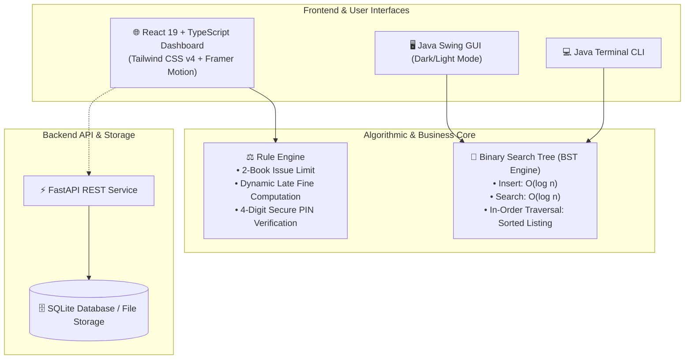

Here is the complete, formatted Markdown content for your GitHub `README.md`. 

You can click the **Copy** button at the top right of the code block below and paste it directly into the GitHub editor on your screen, then click the green **Commit changes...** button!

```markdown
# 📚 NextGen Library Management System
### *High-Performance Catalogue Search using Binary Search Tree (BST) & Modern Web Ecosystem*

[](https://reactjs.org/)
[](https://www.typescriptlang.org/)
[](https://tailwindcss.com/)
[](https://vitejs.dev/)
[](https://www.oracle.com/java/)
[](https://fastapi.tiangolo.com/)
[](https://opensource.org/licenses/MIT)

---

## 🌟 Overview

The **NextGen Library Management System** is an end-to-end library cataloging and borrowing management platform. It bridges core **Data Structures & Algorithms (DSA)** with a responsive, modern **React 19 + TypeScript** frontend, **Java Swing Desktop GUI**, and a **Python FastAPI** backend.

At its core, the search engine utilizes a **Binary Search Tree (BST)** algorithm to achieve $\mathcal{O}(\log n)$ catalogue searches, real-time in-order sorted listings, and dynamic node manipulations (insertion and deletion).

---

## 🏗️ System Architecture



---

## 🌳 Data Structures & Algorithmic Design

### Why a Binary Search Tree (BST)?
Searching large library catalogues using traditional linear structures (arrays/linked lists) takes $\mathcal{O}(n)$ time. By organizing catalogue records inside a self-sorting Binary Search Tree:

| Operation | Linear Search / Array | Binary Search Tree (Average) | Binary Search Tree (Worst) |
| :--- | :--- | :--- | :--- |
| **Search by Title** | $\mathcal{O}(n)$ | **$\mathcal{O}(\log n)$** | $\mathcal{O}(n)$ |
| **Insert New Book** | $\mathcal{O}(1)$ or $\mathcal{O}(n)$ | **$\mathcal{O}(\log n)$** | $\mathcal{O}(n)$ |
| **Delete Book Record** | $\mathcal{O}(n)$ | **$\mathcal{O}(\log n)$** | $\mathcal{O}(n)$ |
| **Sorted Listing** | $\mathcal{O}(n \log n)$ | **$\mathcal{O}(n)$** (In-Order Traversal) | $\mathcal{O}(n)$ |

### Algorithmic Highlights
- **Lexicographical BST Node Insertion**: Dynamically organizes titles in alphabetical order.
- **In-Order Traversal**: Produces sorted catalogue listings directly from the tree structure.
- **Visual Tree Hierarchy**: Generates 2D hierarchical tree maps to visualize nodes and branch levels.
- **Dynamic Node Deletion**: Supports 3-case deletion with in-order successor swapping.

---

## ✨ Key Features

### 👨‍💼 Librarian / Admin Portal
- **Real-Time Inventory Control**: Add new titles, delete existing records, and modify stock counts with slider controls.
- **Live Metrics Dashboard**: Real-time counters for *Total Inventory*, *Available Stock*, *Currently Issued*, and *Overdue Returns*.
- **Return Verification**: Secure 4-digit PIN/OTP verification to safely acknowledge returned books.
- **Student Profile Management**: Register student accounts, monitor fine warnings, and inspect activity histories.
- **Damage & Condition Reporting**: Track book physical condition and apply penalty assessments.

### 🎓 Student / Member Portal
- **Instant Search**: Search catalogue items with live availability tags.
- **Self-Service Checkout**: Request book issues with built-in enforcement of the **2-book borrowing limit**.
- **Automated Fine & Grace Period Engine**: Daily fine computation with built-in grace periods.
- **Activity & Due Date Tracking**: Real-time notifications and due date reminders.
- **Personal Profile**: Edit phone number, update profile pictures, and review borrowing history.

---

## 💻 Tech Stack

| Layer | Technologies |
| :--- | :--- |
| **Frontend Web** | React 19, TypeScript, Vite 6, Tailwind CSS v4, Framer Motion, Zustand, Lucide Icons |
| **Desktop App** | Java 17+, Java Swing (Nimbus L&F, Dark & Light Mode) |
| **Backend REST API** | Python 3.10+, FastAPI, SQLAlchemy, Pydantic, Uvicorn |
| **Database & Files** | SQLite, Flat File Logs (`x.txt`, `y.txt`, `z.txt`, `append.txt`) |

---

## 🔑 Default Credentials

### 🛡️ Librarian / Admin
- **Username / ID:** `abc123`
- **Password:** `abc@123`

### 👥 Test Student Accounts
| Student Name | University ID / Password | Department |
| :--- | :--- | :--- |
| **Nishant Kumar Jha** | `Nkj@123` | B.Tech - AIDS|
| **Pratiksha Sinha** | `Ps@123` | B.Tech - AIDS |
| **Anushaka Kumari** | `Ak@123` | B.Tech - AIDS |
| **Amtul Rula Shaikh** | `Ars@123` | B.Tech - AIDS |

---

## 🚀 Getting Started

### 1. Prerequisites
- **Node.js** (v18+) & **npm**
- **Java Development Kit (JDK 17+)** *(Optional, for Java desktop/CLI)*
- **Python 3.10+** *(Optional, for FastAPI backend)*

---

### 2. Running the Web Application (React + Vite)

```bash
# 1. Clone the repository
git clone https://github.com/Nishant-jha12/Library-Management-System.git
cd Library-Management-System

# 2. Install dependencies
npm install

# 3. Start the Vite development server
npm run dev
```

Open your browser at: **`http://localhost:5173`**

---

### 3. Running the Java Desktop GUI / CLI

```bash
# Compile Java source files
javac library_management.java LibraryGUI.java

# Run Java Swing GUI
java LibraryGUI

# Or run the terminal CLI version
java library_management
```

---

### 4. Running the FastAPI Backend

```bash
# Install Python backend dependencies
pip install fastapi uvicorn sqlalchemy pydantic

# Start FastAPI server
uvicorn backend.main:app --reload --port 8000
```
- Interactive API Docs: `http://localhost:8000/docs`

---

## 📜 Business Rules & Constraints

1. **Max Borrowing Capacity**: A student can issue a maximum of **2 books** simultaneously.
2. **Stock Validation**: Books with `0` quantity are disabled from checkout.
3. **Due Date & Fines**:
   - Standard borrowing duration: **14 days**.
   - Grace period: **1 hour** past due date.
   - Overdue penalty: **₹10 / day** (first 5 days), **₹15 / day** thereafter.
4. **PIN Verification**: Every return generates a unique 4-digit PIN for librarian sign-off.

---

## 🤝 Contributing

Contributions, issues, and feature requests are welcome!

1. Fork the repository
2. Create your feature branch (`git checkout -b feature/AmazingFeature`)
3. Commit your changes (`git commit -m 'Add some AmazingFeature'`)
4. Push to the branch (`git push origin feature/AmazingFeature`)
5. Open a Pull Request

---

## 📄 License

Distributed under the **MIT License**. See `LICENSE` for more information.

---

<div align="center">
  <sub>Built with ❤️ by Nishant Kumar Jha & Team</sub>
</div>
```


